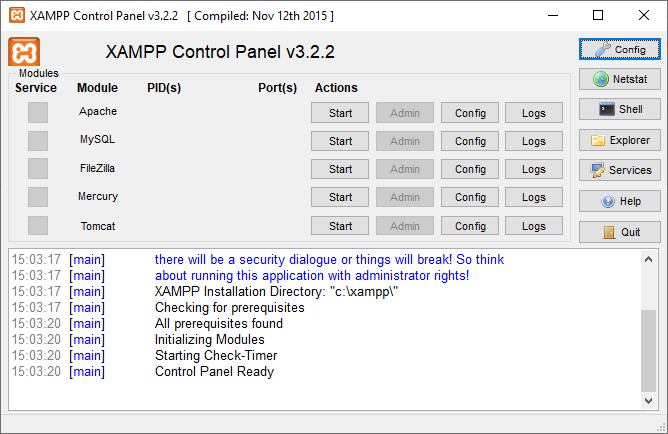
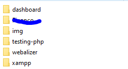

# shiftClock
A simple PHP project that tracks a full-time working shift with lunch interval.

## How to run it on your machine

1. Download XAMPP and install it.
2. Once installed, run it. On Windows machines the .exe often is directly after C:/xampp folder. The file you're going to run is *xampp-control.exe*.
2.1: Once you ran the executable, a window like this will appear:

2.2.: Click on *Start* on Apache and MySQL rows.

3. Inside the xampp folder, there is a folder called *htdocs*. Open it.
4. Create a folder with the name you wish. Mine was *testing-php*.
**DISCLAIMER: The other folders are creations of mine; they don't need to show up on your folder as well!**

5. Put all the source code from this project inside this folder.

6. Go to your favorite browser - mine is Chrome! Open it.

7. On the URL bar, type "localhost/testing-php" and hit Enter.

Done!
